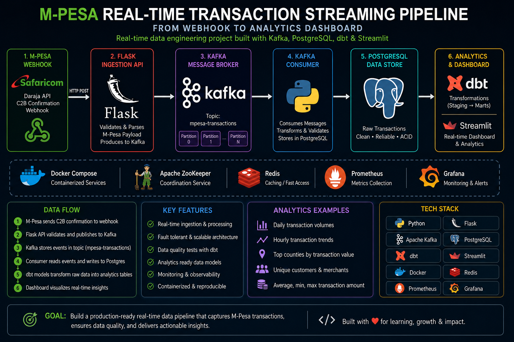
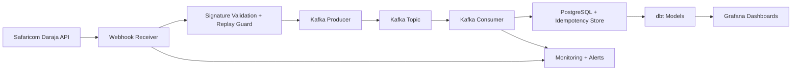

<p align="center">
  
</p>

# M-Pesa Real-Time Transaction Streaming Pipeline

A production-style real-time payments platform for ingesting, validating, processing, and monitoring M-Pesa transaction events with security, idempotency, and observability built in.

## Executive summary

This project implements a real-time fintech event pipeline that ingests Safaricom Daraja callbacks, protects against replay and duplicate transactions, streams events through Kafka, stores durable records in PostgreSQL, and exposes operational and business dashboards through Grafana and dbt-driven analytics models.

It is designed to reflect the operational patterns expected in modern payment and transaction systems:

- webhook validation and replay protection
- durable idempotency and message state tracking
- Kafka producer/consumer resilience with retry and DLQ flow
- health checks, monitoring, and alert thresholds
- release controls and environment-safe configuration

---

## What the platform does

- Accepts and validates M-Pesa webhook events from the Safaricom API
- Rejects replayed or duplicate transactions before they reach business processing
- Publishes events to Kafka for asynchronous, scalable processing
- Tracks consumer retries, dead-letter handling, and processing state in the database
- Stores verified transaction and operational data for analytics and reconciliation
- Exposes operational dashboards and quality checks for real-time platform monitoring

---

## Architecture at a glance



---

## Key implementation areas

- Ingestion and validation: Flask-based webhook service with strict signature and replay checks
- Event streaming: Kafka producer/consumer pipeline with retry and DLQ logic
- Persistence: PostgreSQL-backed transactional and idempotency state tracking
- Analytics and quality: dbt models, staging and marts, and data-quality checks
- Observability: health monitoring, alert rules, and Grafana operational views
- Release discipline: environment-config enforcement, production approvals, rollback docs, and health gates

---

## Production readiness highlights

The project has been hardened around the operational realities of a fintech event stream:

- env-safe configuration with no repo-stored plaintext secrets
- webhook message signing validation and replay protection
- database-backed deduplication instead of in-memory-only caching
- consumer-side retry and DLQ handling for failed message processing
- alert thresholds and health checks aligned to production service risk
- runbook, rollback checklist, emergency response flow, and SLO documentation

---

## Repository layout

- app/ — FastAPI app, config, and runtime settings
- ingestion/ — webhook receiver, Kafka producer/consumer, health checks, DLQ logic
- dashboards/ — Grafana dashboard definitions and provisioners
- dbt/ — transformation and analytics models
- monitoring/ — Prometheus and alert rules
- kubernetes/ — production deployment manifests and namespace wiring
- docs/ — runbook, rollback, architecture, SLO, and incident response docs
- tests/ — unit and smoke validation for config and idempotency behavior

---

## Quick start

### 1. Clone the repository

```bash
git clone https://github.com/Victor-Kipruto-Rop/Real_Time_Transaction_Streaming-MPESA-.git
cd Real_Time_Transaction_Streaming-MPESA-
```

### 2. Start the stack

```bash
make docker-up
```

### 3. Check service health

```bash
curl -s http://localhost:5000/health | python -m json.tool
```

### 4. Send a sample transaction event

```bash
curl -s -X POST http://localhost:5000/webhook/c2b/confirmation \
  -H 'Content-Type: application/json' \
  -d '{"TransID":"TXN123","TransAmount":"500","MSISDN":"254712345678","AccountReference":"ACC001","TransTime":"20260514120000"}'
```

---

## Validation and release quality

The project includes automated verification around the runtime contract and production gate logic. The baseline validation run is:

```bash
python3 -m pytest tests/unit/test_config_loading.py tests/unit/test_idempotency_store.py tests/e2e/smoke_tests.py -q
```

This validates the environment configuration contract, database-backed idempotency store behavior, and end-to-end smoke coverage.

---

## Operational documentation

- [docs/ARCHITECTURE.md](docs/ARCHITECTURE.md) — detailed architecture and responsibilities
- [docs/PRODUCTION_RUNBOOK.md](docs/PRODUCTION_RUNBOOK.md) — release and deployment process
- [docs/ROLLBACK_CHECKLIST.md](docs/ROLLBACK_CHECKLIST.md) — rollback procedure and verification
- [docs/EMERGENCY_RESPONSE.md](docs/EMERGENCY_RESPONSE.md) — incident workflow and comms flow
- [docs/SERVICE_SLOS.md](docs/SERVICE_SLOS.md) — service targets and alerting guardrails
- [docs/PRODUCTION_DASHBOARD_PACK.md](docs/PRODUCTION_DASHBOARD_PACK.md) — dashboard pack and ops view map
- [docs/RELEASE_CHECKLIST.md](docs/RELEASE_CHECKLIST.md) — production release checklist

---

## Ownership and contact

Victor Kipruto Rop

GitHub: https://github.com/Victor-Kipruto-Rop  
Email: kiprutovictor39@gmail.com

---

## Summary

This repository is positioned as a real-time transaction streaming and analytics platform with a strong engineering baseline for secure fintech event processing, production monitoring, and controlled deployment maturity. It is suitable for internal demo use, platform evaluation, and further hardening toward a live production environment.